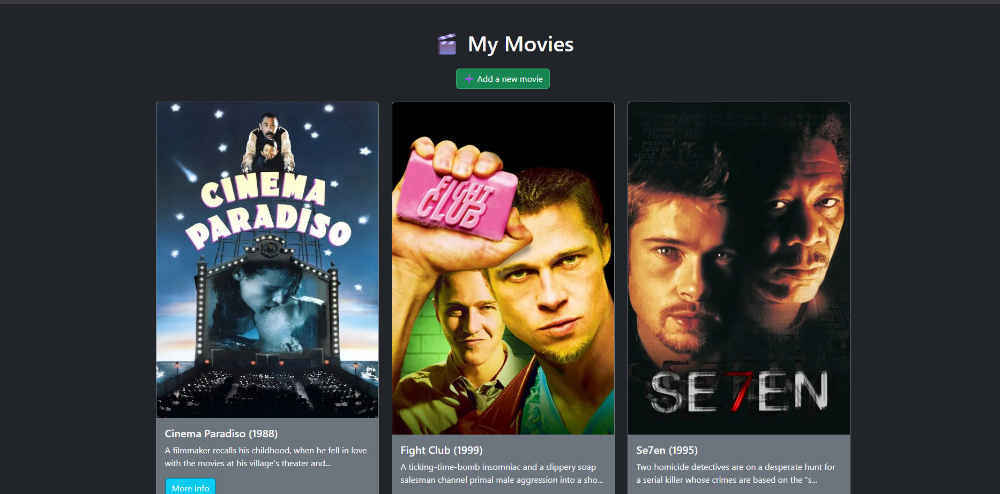
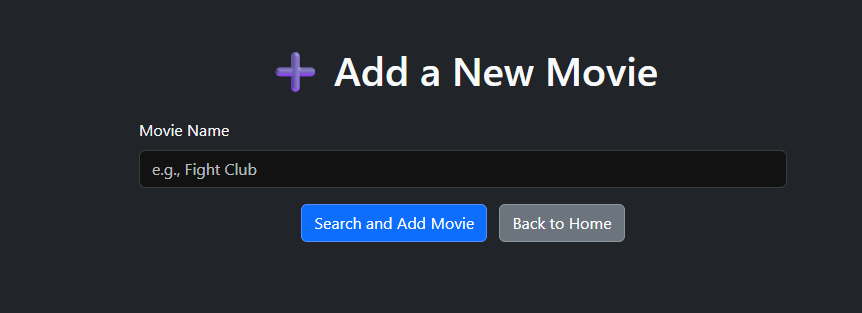

# MovieTracker
#### Video Demo: https://youtu.be/3EDfl52hh84
#### Description:

MovieTracker is a web application designed to help movie lovers organize and manage their personal movie collection. Users can add movies, view detailed information, and maintain a customized list of favorites.

The app focuses on simplicity, functionality, and clean design — making it easy for users to track what they've watched or plan to watch next.

#### Features:

- Add movies to your personal collection using a simple form.
- View a list of all added movies with basic info.
- Click on any movie to see detailed information.
- Clean and responsive user interface.
- Data stored securely using a PostgreSQL database.


#### Technologies Used:

- **Python** – for the backend logic using Flask.
- **Flask** – lightweight web framework to handle routing and server-side operations.
- **PostgreSQL** – for storing movie data in a relational database.
- **SQLAlchemy** – ORM (Object Relational Mapper) to interact with the database.
- **HTML5 & CSS3** – for structuring and styling the web pages.
- **Bootstrap** – to build a responsive and clean UI.
- **JavaScript** – for any client-side interactions and enhancements.


#### Installation:

1. **Clone the repository:**

   ```bash
   git clone https://github.com/your-username/MovieTracker.git
   cd MovieTracker


Create a virtual environment:
python -m venv venv
source venv/bin/activate     # On macOS/Linux
venv\Scripts\activate        # On Windows


Install the dependencies:
pip install -r requirements.txt

Set up the database:
flask db init
flask db migrate
flask db upgrade

Run the application:
flask run

Visit in your browser:
http://127.0.0.1:5000/


#### Usage:

Once the app is running locally, you can:

- Access the homepage to view your movie list.
- Click “Add Movie” to enter a new movie with its title, director, genre, and release year.
- Browse your movie collection and click any movie to view more details.
- Use the clean interface to track your watchlist and favorites.


#### Future Plans:

- Add functionality to edit or delete movies from the list.
- Integrate external movie APIs to fetch posters and real-time data.
- Allow users to rate and review movies.
- Implement user authentication for multiple personalized collections.
- Deploy the app online using a cloud platform (e.g., Render, Heroku).


#### Screenshots:

**Homepage View**



---

**Add Movie Form**




---

#### License

This project is licensed under the MIT License - see the [LICENSE](LICENSE) file for details.
